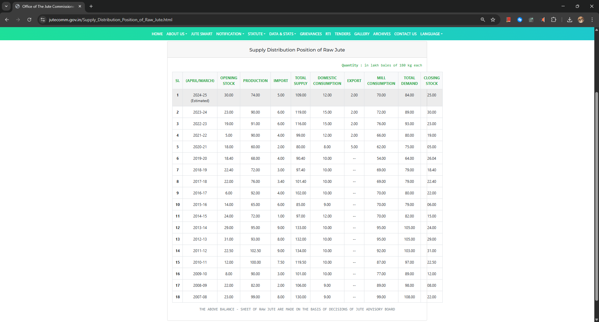
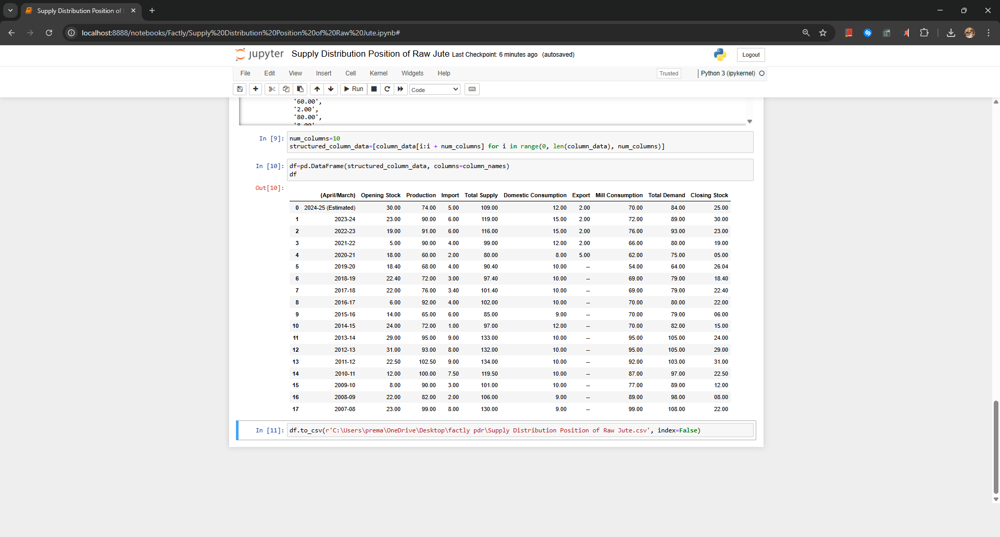

# 🧵 Raw Jute Supply Distribution Web Scraping & Data Cleaning

This project scrapes and processes the *Supply Distribution Position of Raw Jute* data published on the [Jute Commissioner's official website](https://jutecomm.gov.in/Supply_Distribution_Position_of_Raw_Jute.html). 

It was completed as part of my Public Data Research internship at **Factly Media & Research**.

## 📌 Skills Demonstrated
- Python
- Web Scraping using `requests` and `BeautifulSoup`
- Data structuring with `pandas`
- Exporting cleaned data to CSV
- Final touches using Excel for public-friendly formatting

## 📊 Data Columns

- Opening Stock  
- Production  
- Import  
- Total Supply  
- Domestic Consumption  
- Export  
- Mill Consumption  
- Total Demand  
- Closing Stock

## 🖼️ Screenshots

| Web Table | Output in Jupyter |
|-----------|-------------------|
|  |  |

## 🛠️ Setup Instructions

```bash
pip install -r requirements.txt
